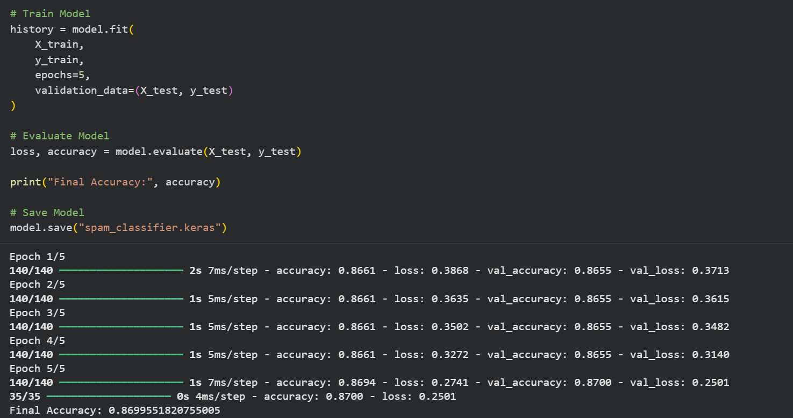
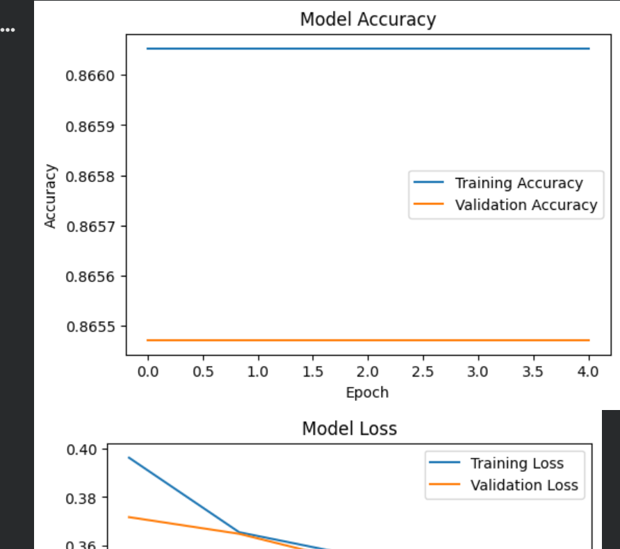
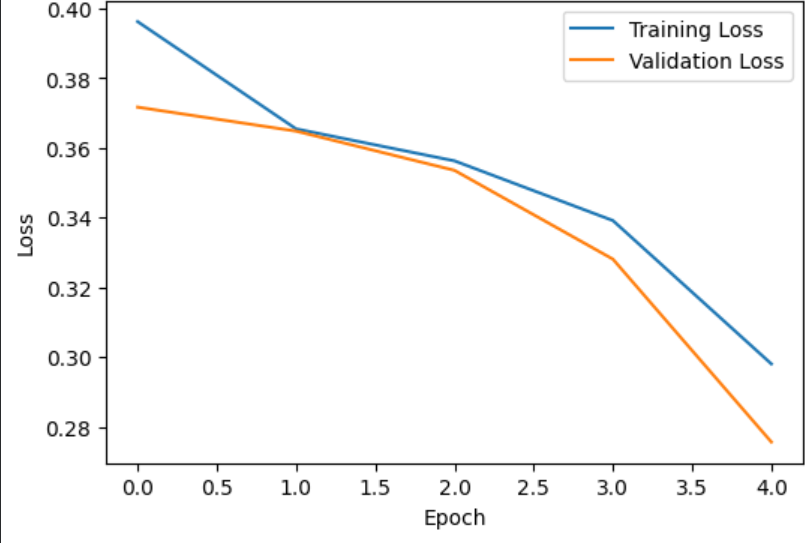

# Text Classification using TensorFlow

## Overview

This project demonstrates a text classification system built using TensorFlow and Python. The model processes text data, learns meaningful patterns, and predicts the appropriate category for new text inputs. The project showcases the complete machine learning workflow, including data preprocessing, model training, evaluation, and prediction.

---

## Features

* Text preprocessing and cleaning
* Tokenization and sequence padding
* Neural network model built with TensorFlow
* Model training and validation
* Performance evaluation
* Prediction on unseen text samples

---

## Technologies Used

* Python
* TensorFlow
* NumPy
* Pandas
* Matplotlib
* Scikit-learn
* Jupyter Notebook

---

## Project Structure

```text
Text-Classification-using-TensorFlow/
│
├── text_classification.ipynb
├── README.md
├── requirements.txt
├── LICENSE
└── images/
    ├── accuracy.png
    ├── loss.png
    └── prediction.png
```

---

## Dataset

This project uses a labeled text dataset for supervised text classification.

The preprocessing pipeline includes:

* Text cleaning
* Tokenization
* Sequence padding
* Training and testing split

---

## Model Workflow

1. Load the dataset
2. Preprocess the text
3. Convert text into numerical sequences
4. Build a TensorFlow neural network
5. Train the model
6. Evaluate performance
7. Predict new text samples

---

## Results

The model successfully learns text patterns and performs classification on unseen data.

Example evaluation metrics include:

* Training Accuracy
* Validation Accuracy
* Loss Curves
* Sample Predictions

*(Replace this section with your actual accuracy values if available.)*

---

## Installation

Clone the repository:

```bash
git clone https://github.com/vishweshgade1225-dot/Text-Classification-using-TensorFlow.git
```

Install the required packages:

```bash
pip install -r requirements.txt
```

---

## Usage

Open the notebook:

```bash
jupyter notebook text_classification.ipynb
```

Run the notebook cells sequentially to preprocess the data, train the model, and evaluate its performance.

---

## Future Improvements

* Experiment with Transformer-based models
* Improve text preprocessing
* Hyperparameter tuning
* Deploy the model as a web application
* Support multi-class classification on larger datasets

---

## Author

**Vishwesh Gade**

If you found this project helpful, consider giving the repository a ⭐.
## Model Performance

### Accuracy



### Loss



### Training Results


